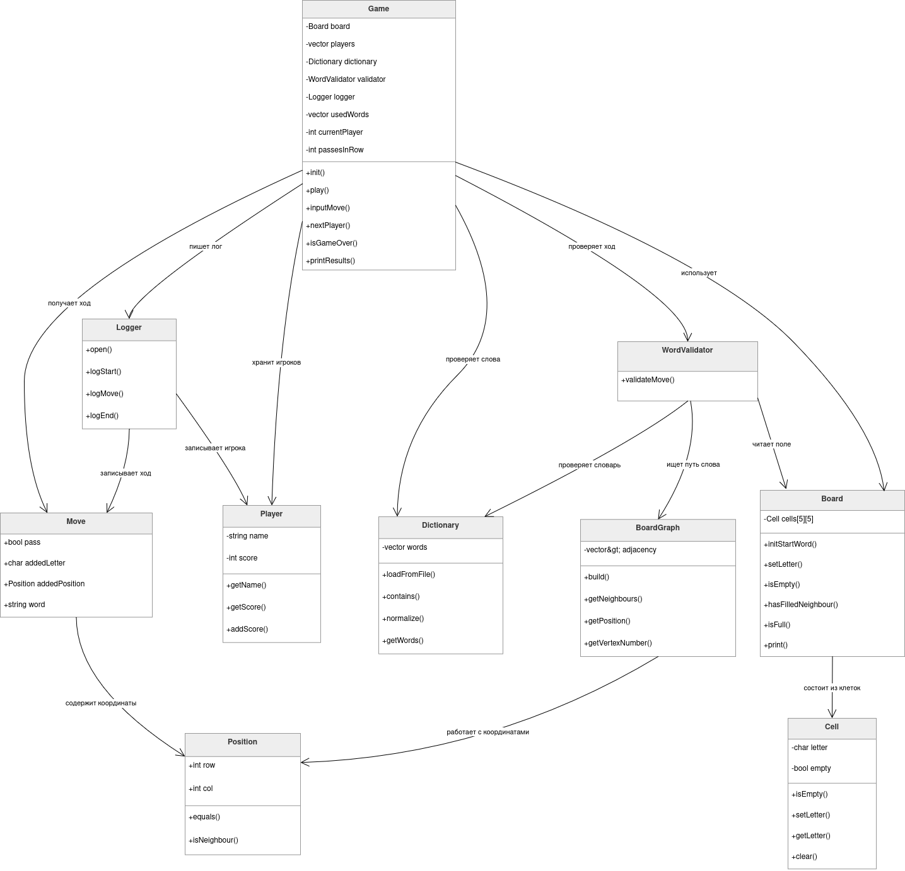

# Консольная игра «Слова»

Программа реализует консольный вариант игры «Слова» для 2–4 игроков на языке C++.

Игроки по очереди добавляют буквы на квадратное поле 5×5 и составляют слова по соседним клеткам. Переход между буквами возможен только по вертикали и горизонтали. За каждую букву составленного слова игрок получает одно очко.

## Возможности программы

* игра для 2–4 игроков;
* поле размером 5×5;
* стартовое слово размещается в центральной строке;
* проверка слов по словарю `dictionary.txt`;
* запрет повторного использования слов;
* проверка построения слова по соседним клеткам;
* возможность пропустить ход командой `pass`;
* завершение игры при заполнении поля;
* завершение игры после трёх кругов пропусков;
* проверка невозможности дальнейшего хода;
* подсчёт очков;
* запись действий игроков в файл `log.txt`.

## Структура проекта

```text
main.cpp              точка входа в программу
Game.h / Game.cpp     основной игровой цикл
Board.h / Board.cpp   игровое поле
Cell.h / Cell.cpp     клетка игрового поля
Player.h / Player.cpp игрок
Move.h                описание хода
Position.h / .cpp     координаты клетки
Dictionary.h / .cpp   работа со словарём
WordValidator.h / .cpp проверка хода
BoardGraph.h / .cpp   граф соседства клеток
Logger.h / .cpp       запись лога
dictionary.txt        файл со словами
```

## Компиляция

Для компиляции можно использовать команду:

```bash
g++ -std=c++17 -Wall -Wextra -pedantic \
Board.cpp BoardGraph.cpp Cell.cpp Dictionary.cpp Game.cpp Logger.cpp \
main.cpp Player.cpp Position.cpp WordValidator.cpp -o wordgame
```

Или короче:

```bash
g++ -std=c++17 *.cpp -o wordgame
```

## Запуск

```bash
./wordgame
```

## Файл словаря

Перед запуском рядом с программой должен находиться файл:

```text
dictionary.txt
```

В нём каждое слово должно быть записано с новой строки.

Пример:

```text
apple
table
stone
water
green
```

## Правила ввода хода

Во время хода игрок вводит:

1. букву, которую хочет поставить;
2. координаты клетки;
3. слово, которое он составил.

Координаты вводятся числами от `0` до `4`.

Пример хода:

```text
Введите букву или pass для пропуска хода: a
Введите строку и столбец новой буквы: 1 2
Введите составленное слово: apple
```

Чтобы пропустить ход:

```text
pass
```

## Логирование

Все основные действия записываются в файл:

```text
log.txt
```

В лог записываются:

* начало игры;
* список игроков;
* стартовое слово;
* ходы игроков;
* ошибки ходов;
* пропуски;
* итоговые очки;
* победитель.

## Завершение игры

Игра заканчивается, если:

* заполнены все клетки поля;
* игроки сделали три круга пропусков подряд;
* больше невозможно составить ни одного допустимого слова.

## Победитель

Побеждает игрок, набравший больше всего очков.
Если несколько игроков набрали одинаковое максимальное количество очков, объявляется ничья.

## Объектная модель

