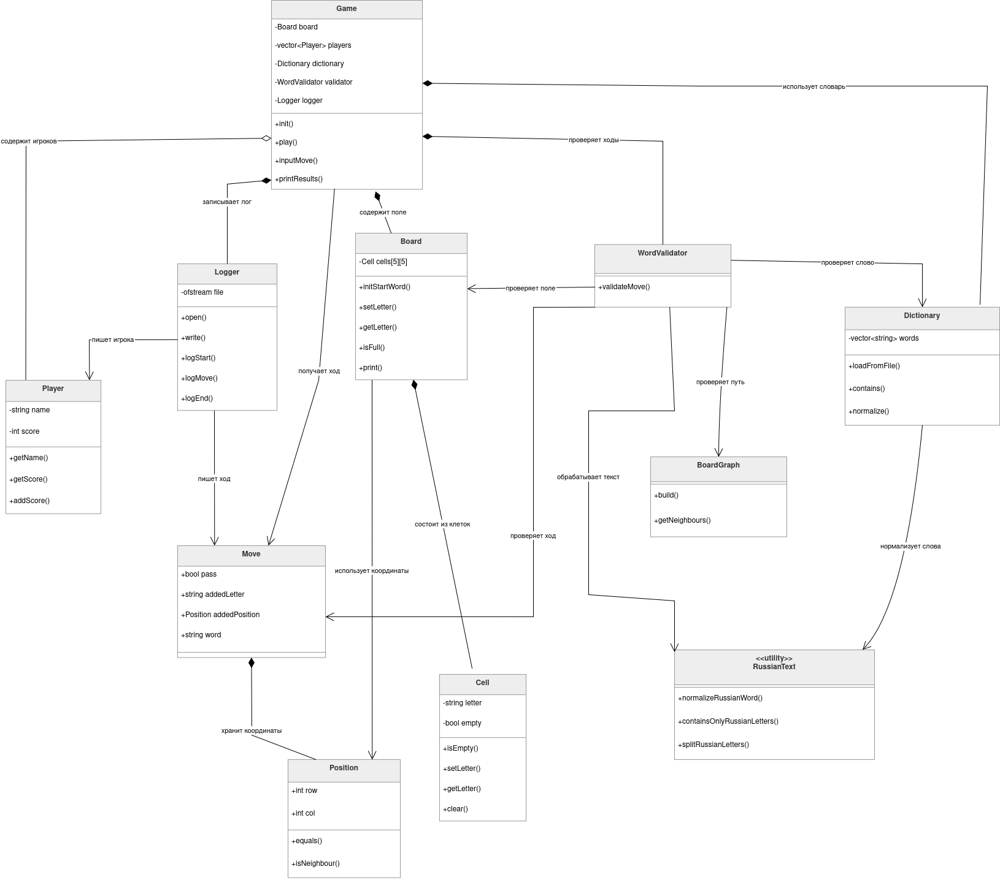
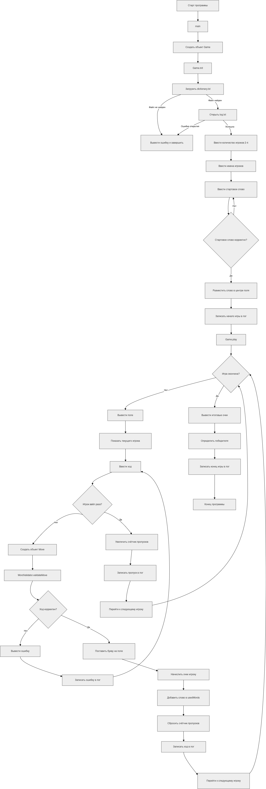

# Консольная игра «Слова»

Консольная версия игры «Слова» для 2-4 игроков на C++.

Игроки по очереди добавляют русские буквы на квадратное поле 5x5 и составляют слова по соседним клеткам. Переход между буквами разрешён только по вертикали и горизонтали. Каждая буква составленного слова приносит игроку одно очко.


## Объектная модель




## Функциональная схема



## Возможности

* игра для 2-4 игроков;
* поле 5x5;
* стартовое слово из 5 русских букв размещается в центральной строке;
* проверка слов по русскому словарю `dictionary.txt`;
* поддержка русских букв в UTF-8;
* буквы `е` может заменяться на `ё` ;
* запрет повторного использования слов;
* проверка построения слова по соседним клеткам без повторного использования клетки;
* возможность пропустить ход командой `pass`;
* завершение игры при заполнении поля;
* завершение игры после трёх кругов пропусков подряд;
* завершение игры, если невозможно составить очередное допустимое слово;
* подсчёт очков;
* запись хода игры в `logs/log.txt`.

## Структура проекта

```text
Makefile                 сборка, запуск и очистка проекта
README.md                описание проекта
dictionary.txt           русский словарь допустимых слов

include/                 заголовочные файлы
  Board.h                игровое поле
  BoardGraph.h           граф соседства клеток
  Cell.h                 клетка игрового поля
  Dictionary.h           работа со словарём
  Game.h                 основной игровой цикл
  Logger.h               запись лога
  Move.h                 описание хода
  Player.h               игрок
  Position.h             координаты клетки
  RussianText.h          работа с русскими UTF-8 буквами
  WordValidator.h        проверка хода

src/                     исходные файлы
  main.cpp               точка входа
  *.cpp                  реализации классов

docs/                    схемы проекта
  ObjectModel.png
  ProgrammOrder.png

logs/                    лог-файлы игры
```

## Сборка

Для сборки используется `Makefile`.

```bash
make build
```

После сборки в корне проекта появится исполняемый файл:

```text
words_game
```

Очистить артефакты сборки можно командой:

```bash
make clean
```

## Запуск

```bash
make run
```

Или напрямую после сборки:

```bash
./words_game
```

Запускать программу нужно из корня проекта, чтобы рядом был доступен файл `dictionary.txt`.

## Словарь

Файл `dictionary.txt` должен быть сохранён в UTF-8. Каждое слово записывается с новой строки.

Словарь должен содержать русские допустимые слова по правилам задания. Программа проверяет наличие слова в словаре, но не определяет автоматически часть речи, падеж и литературность слова. Эти ограничения обеспечиваются содержимым словаря.

Пример:

```text
тромб
карма
кумыс
яблоко
```

`ё` нормализуется в `е`, поэтому слова `ёлка` и `елка` считаются одинаковыми.

## Правила Ввода

При запуске программа запрашивает:

1. количество игроков от 2 до 4;
2. имена игроков;
3. стартовое слово из 5 русских букв.

Во время хода игрок вводит:

1. одну русскую букву или команду `pass`;
2. координаты клетки;
3. составленное слово.

Координаты вводятся числами от `0` до `4`.

Пример:

```text
Введите букву или pass для пропуска хода: а
Введите строку и столбец новой буквы: 1 2
Введите составленное слово: карма
```

Пропуск хода:

```text
pass
```

## Логирование

Все основные действия записываются в файл:

```text
logs/log.txt
```

Папка `logs` создаётся автоматически при запуске, если её нет.

В лог записываются:

* начало игры;
* список игроков;
* стартовое слово;
* ходы игроков;
* ошибки ходов;
* пропуски;
* итоговые очки;
* победитель или ничья.

## Завершение Игры

Игра заканчивается, если:

* заполнены все клетки поля;
* игроки сделали три круга пропусков подряд;
* невозможно составить очередное допустимое слово.

Побеждает игрок с наибольшим количеством очков. Если несколько игроков набрали одинаковый максимальный счёт, объявляется ничья.


## Графические Схемы

В проекте также сохранены PNG-схемы:


